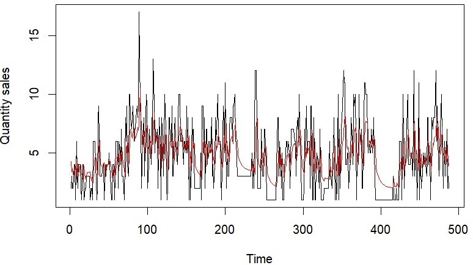
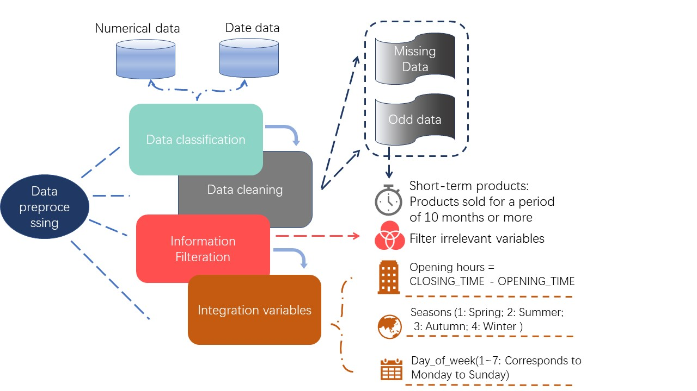
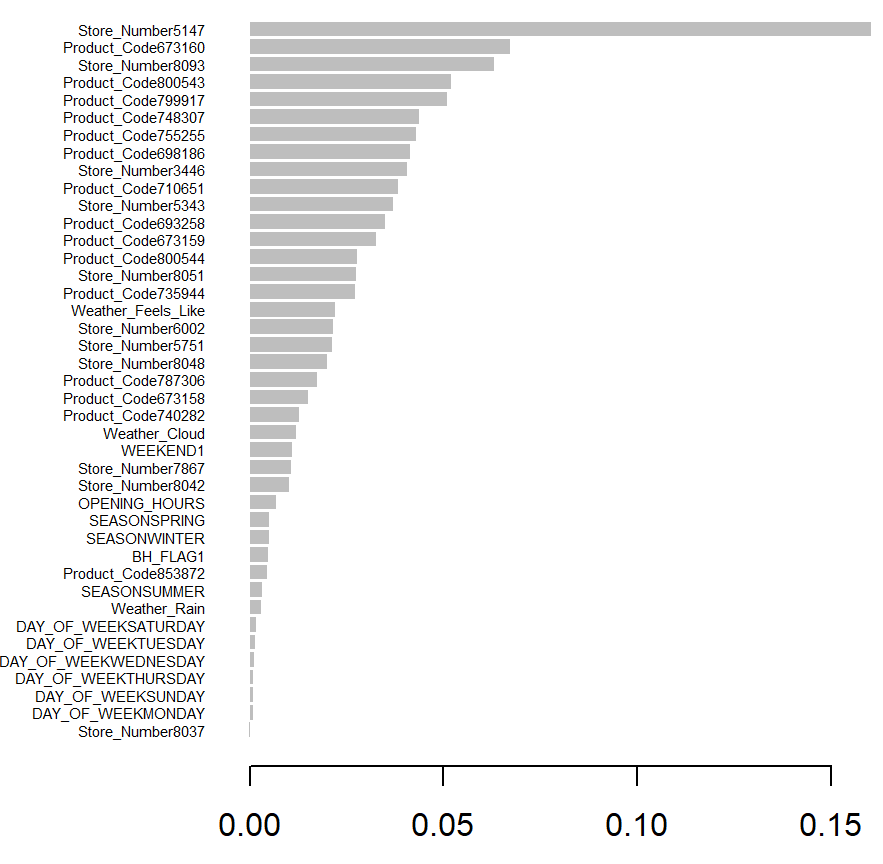

# 📈 Retail Demand Forecasting Engine
**Inventory optimization for in-store bakeries using Time-Series Analysis (ARIMA) and XGBoost.**

## ⚠️ Technical Archive Note
> **Note:** This project involves commercial sales data from **Co-op Food**. Due to Non-Disclosure Agreements (NDA) and data privacy restrictions, the raw source code and datasets cannot be published.
>
> This repository hosts the **Technical Implementation Report**, detailing the feature engineering, model benchmarking process, and final evaluation metrics.

## 💼 Business Context
**The Problem:** In-store bakeries face a critical optimization challenge—products must be baked fresh daily.
- **Over-supply:** Results in waste and financial loss.
- **Under-supply:** Results in missed revenue opportunities.

**The Solution:** A predictive system to forecast daily demand for specific SKUs across 12 store locations, accounting for seasonality, weather impact, and holidays.

## 🛠️ Engineering Pipeline
The solution required a robust data processing pipeline to handle real-world noise (missing bank holiday flags, discontinuous sales data).

### Tech Stack
- **Languages:** R, Python
- **Modeling:** `auto.arima` (Time Series), `XGBoost` (Gradient Boosting), Poisson GLMs.
- **Evaluation:** RMSE (Root Mean Squared Error), AIC (Akaike Information Criterion).

## 📊 Model Benchmarking & Results

We benchmarked three distinct approaches to find the production-optimal model:

| Model Architecture | RMSE (Error) | Performance Verdict |
| :--- | :--- | :--- |
| **Linear Regression** | 3.00 | **Poor.** Failed to capture non-linear seasonality. |
| **Poisson GLM** | 2.86 | **Average.** Handled count data well but struggled with spikes. |
| **XGBoost** | 2.43 | **Good.** Captured weather/holiday features effectively. |
| **ARIMA** | **2.08** | **Best.** Superior handling of temporal dependencies and autocorrelation. |

### Key Insights
*   **Feature Importance:** As visualized below, external factors like *Temperature* and *Store Opening Hours* were critical predictors in the XGBoost model.
*   **Seasonality:** The ARIMA model successfully identified and corrected for weekly cyclic buying patterns.

## 📄 Full Documentation
For a deep dive into the mathematical framework and statistical validation, please view the full report:
[**Download Technical Report (PDF)**](Sales_Forecasting_Report.pdf)
